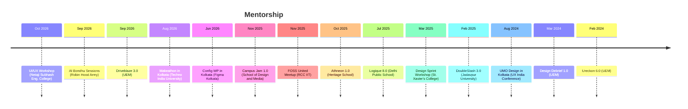

# Hi, I'm Suvra Shaw 👋

Multidisciplinary designer with 3 years of experience across UX design and front-end development, working where design, code, motion and AI meet.

## Mentorship

## Achievements

<table cellpadding="4">
<tr><th align="left" nowrap>Date</th><th align="left">Event</th><th align="left">Host</th><th align="left">Rank</th></tr>
<tr><td nowrap>Oct 2023</td><td><a href="https://www.linkedin.com/posts/prasun--das_achievementunlocked-innovation-techcompetition-activity-7152683380373868544-snvc">Webel-BCC&amp;I Ideathon 7</a></td><td>Webel (a unit of Govt. of West Bengal)</td><td>Winner</td></tr>
<tr><td nowrap>Apr 2022</td><td><a href="https://drive.google.com/file/d/1J6wpG97dY2wzIAOrGfrtTGeHmO9LeoOY/view?usp=drive_link">Product Game 1.0</a></td><td>Ureckon 4.0</td><td>Winner</td></tr>
<tr><td nowrap>Sep 2021</td><td><a href="https://drive.google.com/file/d/1owW14SZGYW5lBUzp2sJPeEvmVGowj1Me/view?usp=sharing">Computer Science Research Fellowship</a></td><td>SARSTEM</td><td>Selected</td></tr>
<tr><td nowrap>Jun 2021</td><td><a href="https://drive.google.com/file/d/1GmSztHlsgxmbWtBLWrpg3H3uY5ZgLVzF/view?usp=drive_link">IEEE PELS Jamboree</a></td><td>St. Joseph's College of Engineering, Chennai</td><td>Winner</td></tr>
<tr><td nowrap>Jun 2021</td><td><a href="https://drive.google.com/file/d/1juLW0cjWISTbFPP7wEP6m83k_p-v_1lL/view?usp=drive_link">Intra-College Project Competition</a></td><td>UEM IETE Student Chapter</td><td>2nd Runner-up</td></tr>
<tr><td nowrap>Mar 2021</td><td><a href="https://www.facebook.com/photo.php?fbid=2790608211253994&set=pb.100064164604415.-2207520000&type=3">EDI's Poster Competition</a></td><td>UEM SPIE Student Chapter</td><td>Runner-up</td></tr>
<tr><td nowrap>Jan 2020</td><td>Embetronix (Robotics Event)</td><td>Kshitij, IIT Kharagpur</td><td>Round 2</td></tr>
<tr><td nowrap>Jan 2020</td><td><a href="https://drive.google.com/file/d/1QMqHAPo_io4wI1uXmJjHQLFfVRUp1NAA/view?usp=drive_link">I-Manthan</a></td><td>Kolkata Police</td><td>Finalist</td></tr>
<tr><td nowrap>Dec 2019</td><td><a href="https://drive.google.com/file/d/18fYEFN5PyUV9U7OpApUiV9bdzq0q7vyh/view?usp=drive_link">India Innovation Challenge Design Contest</a></td><td>AICTE</td><td>Top 8</td></tr>
<tr><td nowrap>Aug 2019</td><td><a href="https://drive.google.com/file/d/1e-p-MhwWuLD_YdASXTgaoC6U_qwSyz_t/view?usp=drive_link">Lumos Quiz, WAVICLE 3.0</a></td><td>Techno Main Salt Lake</td><td>Runner-up</td></tr>
</table>
